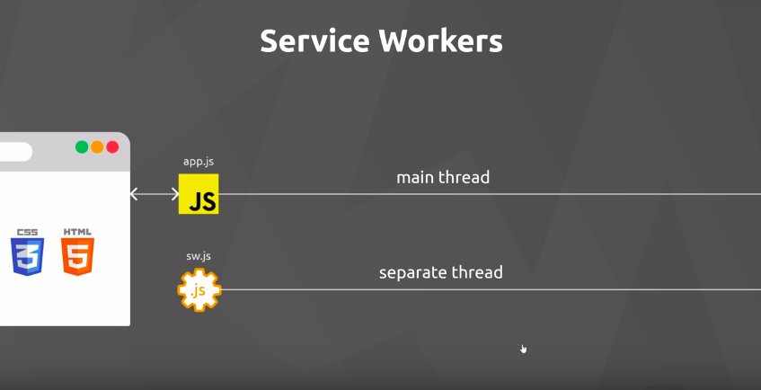
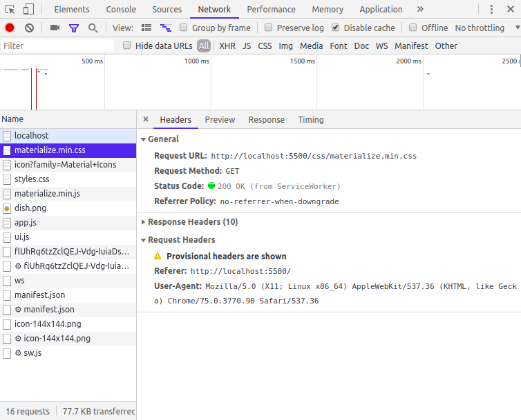

# Add to home screen

[link dos critérios](https://developers.google.com/web/fundamentals/app-install-banners/)


Quando preenchemos determinados requisitos um evento é disparado **beforeinstallprompt** e irá mostrar um pop up ao usuario para baixar a aplicação e adicionar a aplicação na home.


- Uma das partes importantes para atingir esses criterios é ter um sw.
  - **Has registered a service worker with a fetch event handler**


Um **fetch event** ocorre toda vez que tentamos pegar algo do nosso servidor, pode ser arquivos .js .css



O que vai ocorrer é que o sw vai funcionar como um interceptador ouvindo todos os fetch requests, e também como uma proxy entre a nossa aplicação e o servidor 




Para escutar ao **fetch event** acrescentamos ao sw.js:

```javascript
self.addEventListener('fetch', evt => {
  console.log('fetch event', evt);
});
```

Posteriomente vamos ver que o **fetch event** vai ser util para fazermos cache assets


