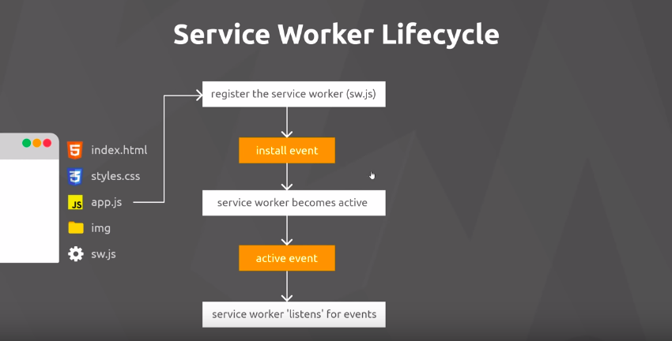
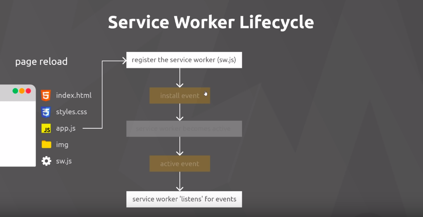
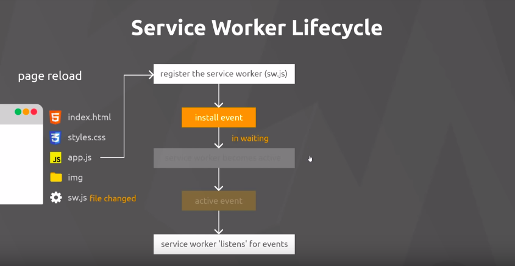
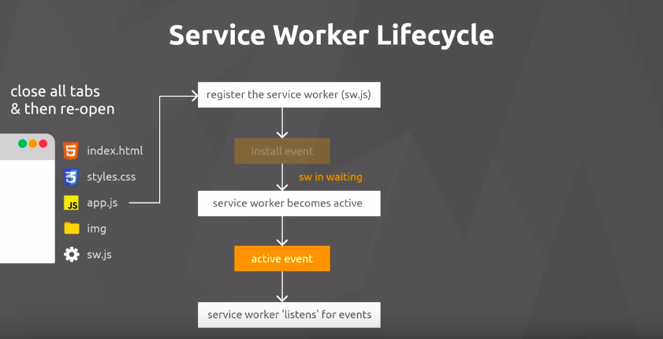

Quando criamos um service worker ele tem um ciclo de vida.

Para tentar representar vamos imaginar um projeto como na imagem abaixo.

Ao criarmos um sw.js no root diretorio da nossa aplicacao, isso nos permite acessar todos os arquivos, ou seja teremos um escopo global da nossa aplicação, o que não iria acontecer caso criassemos dentro de img/.

O primeiro passo para criar:

- Temos que **Registrar** o nosso sw, e fazemos isso no nosso app.js, e ao fazer estamos a dizer ao browser que temos um sw.js que está a rodar em uma thread separada do nosso .js normal.

- O browser ira agora instalar o nosso sw.js, e esse é um dos ciclos, e podemos "escutar" a este evento dentro do proprio sw.js, e podemos reagir a isto de diferentes formas, por exemplo:
    - Asset caching para podermos posteriormente acessar esses arquivos em cache enquanto estivermos offline.
- O **Install event** apenas ocorre quando o sw.js é registrado.

- Apos o install ele se torna um sw ativo.

- Quando o browser verifica que ele esta ativo ele dispara um **Active event**

- Depois que o nosso sw está ativo ele pode acessar todos os arquivos que estão no escopo da aplicação, e agora pode escutar a todos os **Fetch Events** ou sejas aos http request e intercepta-los.

Quando recarregamos a pagina o ciclo de vida é um pouco diferente:

- Primeiro o sw já está registrado, assim o **Install event** só irá ocorrer se o sw for modficado.

- Se houver mudança então ele irá reinstalar o sw mas isso não significa que ele irá substituir o antigo, ele irá ficar em estado de espera até que todas as instancias do nosso sw antigo sejam fechadas e o nosso aplicativo esteja fechado.

- Quando abrirmos novamente ele irá seguir o ciclo normal.

