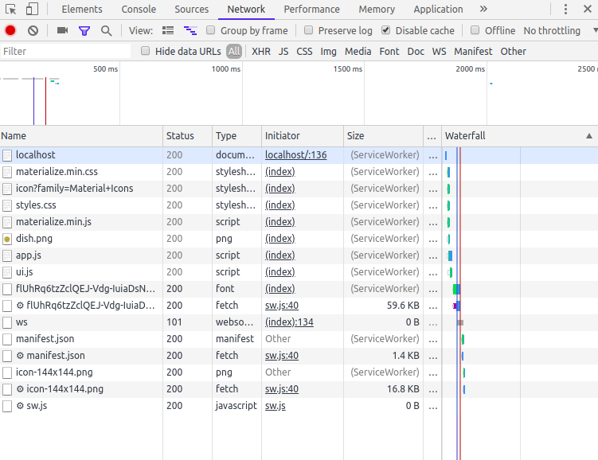

Para implementar corretamente PWA temos que entender o conceito de Service Workers, com ele será possivel:

- Mostrar o conteudo quando estiver offline, e assim será possivel abrir e ver o aplicativo mesmo sem conexão com a rede, isso so será possivel com cache assets e data.
- Sincronização em background, ou seja quando o usuario fizer alguma atualizacao offline por exemplo alterar e-mail, a atualizacao ira ocorrer assim que houver uma conexao.
- Mostrar notificações para o usuario.

*Services Workers* são arquivos JavaScripts, e em uma aplicação normal temos por exemplo arquivos .css .js .html
Esses arquivos ficam em um servidor e quando acessamos a aplicação vimos esses arquivos no browser, por exemplo o html.
Os nossos arquivos js estão conectados normalmente a nossa pagina html.

Quando criamos o *sw.js* ele roda separadamente em uma outra thread isolada do nosso js normal, por essa razao ele nao tem acesso ao DOM, por isso não pode modificar contents.

O *SW* é um processo que roda em background e tem o objetivo de escutar e reagir aos eventos que ocorrem no browser, por exemplo:
- Mostrar notificações e mensagens que possa chegar do servidor
- Interceptar HTTP requests feitos no browser 

